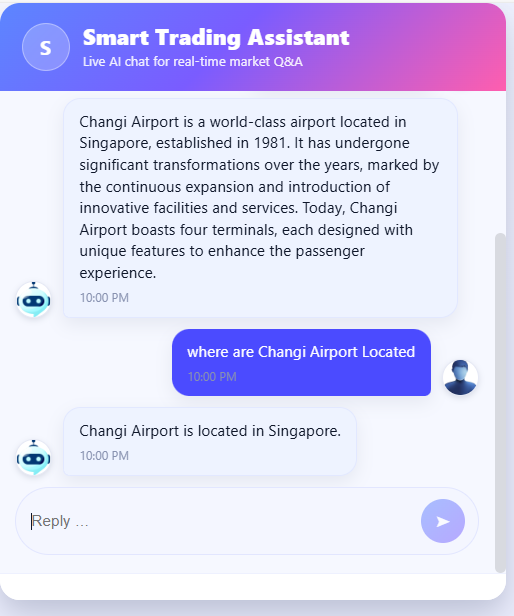

# 🤖 Trading Chatbot App

A **production-ready AI-powered trading assistant** built with **FastAPI (backend)** and **React (frontend)**.  
It uses **RAG (Retrieval-Augmented Generation)** with **Gemini embeddings** + **Pinecone vector DB** to deliver intelligent trading insights in real time.  

The app is fully **Dockerized** — both backend and frontend run together with a single `docker compose up -d`.

---

## 🚀 Features
- 🔍 **Web scraping + preprocessing** for financial data ingestion.  
- 🧠 **RAG pipeline** using Gemini embeddings + Pinecone vector search.  
- ⚡ **FastAPI backend** with modular API routes.  
- 🎨 **React + Nginx frontend** with a modern UI.  
- 🐳 **Docker Compose setup** for running backend & frontend seamlessly.  
- 📊 **Evaluation module** for testing against custom dataset.  

---

## 📸 UI Preview


---

## 📂 Project Structure

```

chatbot\_app/
├── backend/                        # FastAPI backend with RAG pipeline
│   ├── app/
│   │   ├── api.py                  # FastAPI endpoints
│   │   ├── chatbot.py              # RAG pipeline logic
│   │   ├── config.py               # Env config & constants
│   │   ├── embeddings.py           # Gemini embedding setup
│   │   ├── vector\_store.py         # Pinecone operations
│   │   └── utils/
│   │       ├── scraper.py          # Web scraping logic
│   │       └── cleaner.py          # HTML to clean text chunks
│   ├── scrapers/
│   │   └── data/
│   │       └── scraped\_pages.json  # Raw scraped HTML pages
│   ├── evaluation/
│   │   ├── evaluate.py             # Evaluation pipeline
│   │   └── changi\_airport\_dataset.csv # Evaluation dataset
│   ├── requirements.txt            # Python dependencies
│   ├── Dockerfile                  # Backend Docker setup
│   ├── main.py                     # FastAPI app entrypoint
│   └── README.md                   # Backend documentation
│
├── frontend/                       # React frontend + Nginx
│   ├── src/
│   │   ├── services/
│   │   │   └── api.js              # Axios client for backend API
│   │   ├── components/             # React UI components
│   │   └── App.js                  # Main app entry
│   ├── public/
│   │   └── index.html
│   ├── Dockerfile                  # Frontend Docker setup
│   ├── nginx.conf                  # Nginx config
│   └── changi-BG.png               # UI preview image
│
├── docker-compose.yml              # Multi-container setup
└── README.md                       # Main project documentation

````

---

Before running the backend, you need to configure the following credentials in a `.env` file (inside the `backend/` folder):

```ini
# --- Google Gemini API ---
GEMINI_API_KEY=your_gemini_api_key

# --- Pinecone (Vector Database) ---
PINECONE_API_KEY=your_pinecone_api_key
PINECONE_ENVIRONMENT=us-east-1
PINECONE_INDEX=chatbot-index

# --- Groq API (LLM Inference) ---
GROQ_API_KEY=your_groq_api_key

# --- Opik (Evaluation & Monitoring) ---
OPIK_API_KEY=your_opik_api_key
OPIK_WORKSPACE_ID=your_opik_workspace_id
OPIK_PROJECT_NAME=Chagi Chatbot Evaluation
````
## ⚙️ Setup & Usage

### 1. Clone the repository
```bash
git clone https://github.com/your-username/chatbot_app.git
cd chatbot_app
```

### 2. Build and start containers

```bash
docker compose up -d --build
```

This will:

* Build & start the **backend** (FastAPI at port `8000`)
* Build & start the **frontend** (React served by Nginx at port `3000`)

### 3. Access the app

* **Frontend UI (React)** → [http://localhost:3000](http://localhost:3000)
* **Backend API (FastAPI docs)** → [http://localhost:8000/docs](http://localhost:8000/docs)

---

## 🛠 Development Workflow

Stop containers:

```bash
docker compose down
```

Rebuild after code changes:

```bash
docker compose up -d --build
```

Check running containers:

```bash
docker ps
```

View backend logs:

```bash
docker compose logs -f backend
```

---

## 📌 Environment Variables

You can configure the frontend API endpoint in `frontend/.env`:

```
REACT_APP_API_BASE_URL=http://backend:8000
```

By default, it falls back to `http://backend:8000` when running inside Docker Compose.

---

## 🏗 Future Improvements

* Add authentication & user accounts.
* Enhance evaluation with larger financial datasets.
* Deploy to Kubernetes / cloud environment (AWS, GCP).
* Real-time streaming responses with WebSockets.

---
